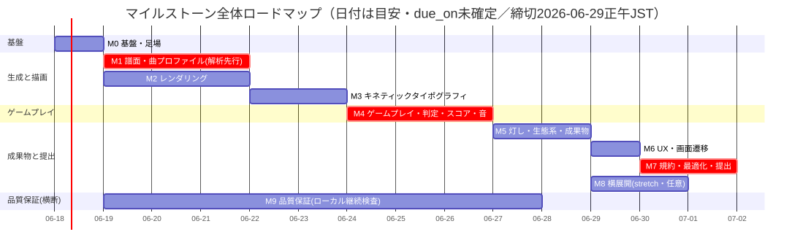
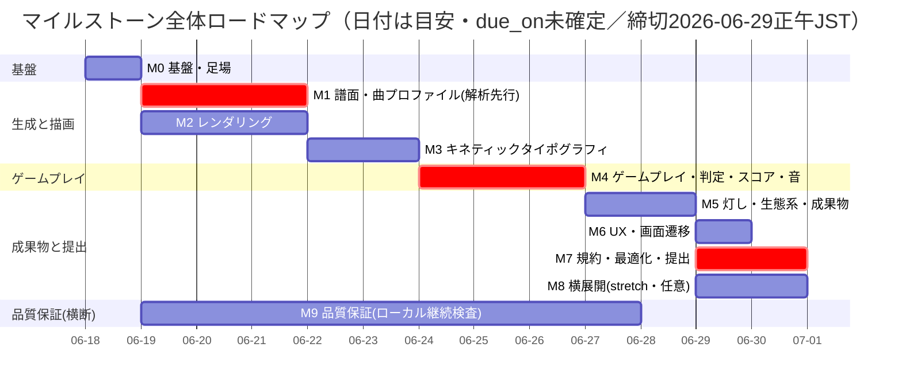
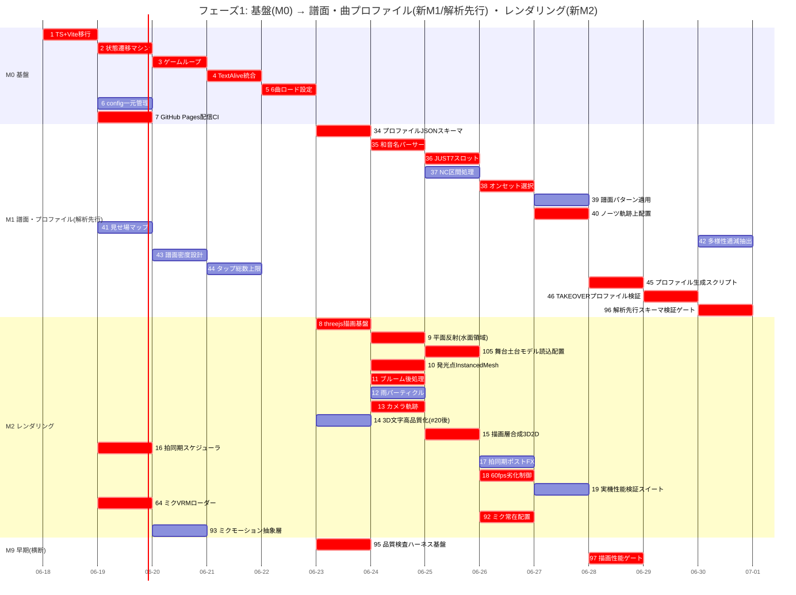
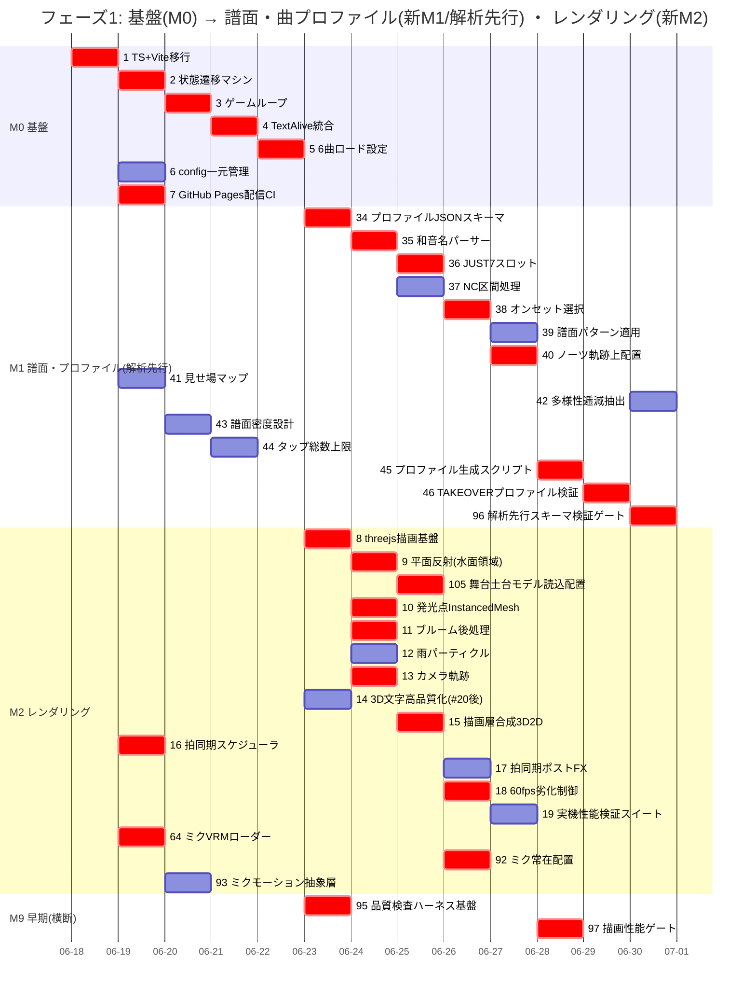
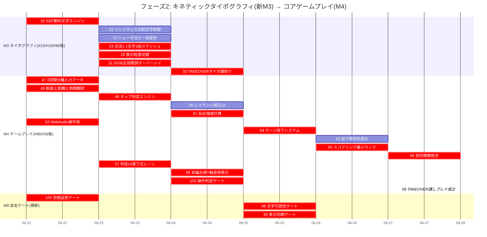
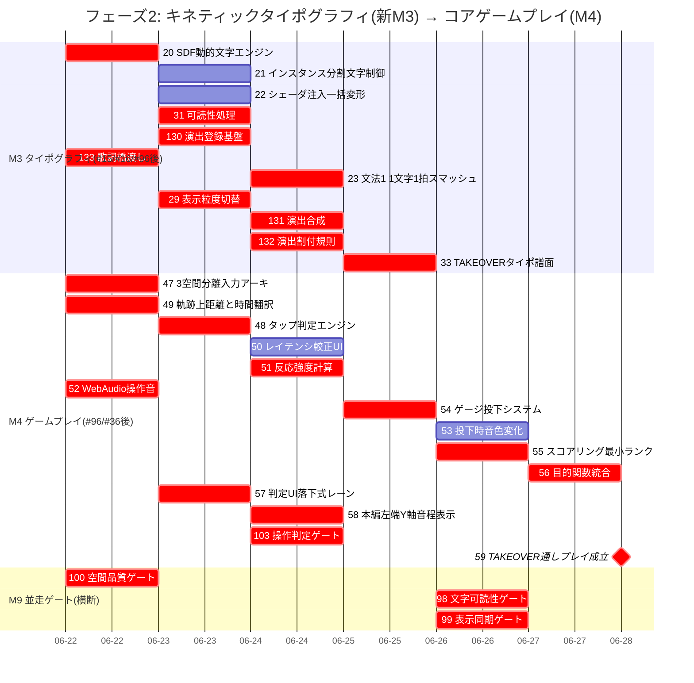
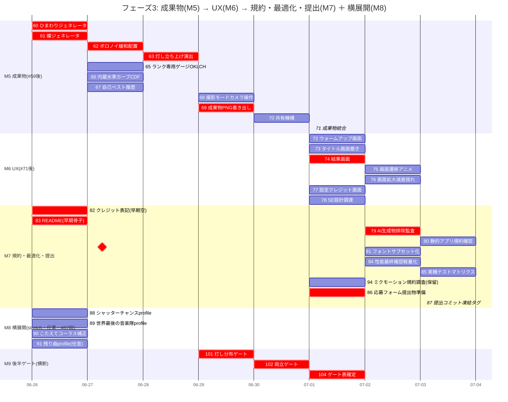
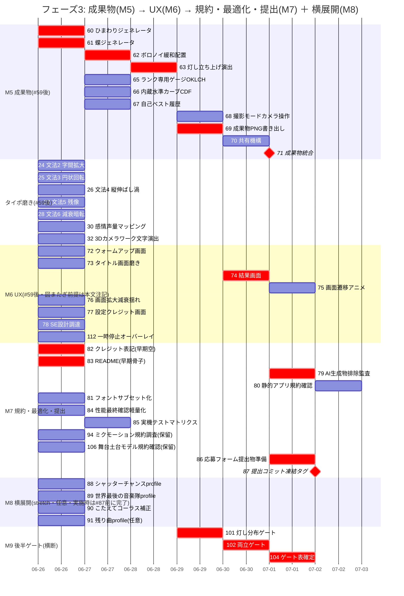

# 開発ロードマップ（マイルストーン／Issue 時系列ガント）

本書は、GitHubのマイルストーンと全107 Issueの「時系列の完了ごとの遷移」をガント図で表す。図は mermaid で作成し、`docs/img/` にSVGとして保存して参照する。各図のmermaidソースは保守のため折りたたみに併記する（ソースを更新したら、mermaid で再レンダリングしてSVGを再生成する）。

## 前提

- マイルストーンの期限（`due_on`）は未確定である。よって図の日付は**提案スケジュールの目安**であり、確定した期限ではない。
- 締切は **2026年6月29日（月）正午（日本標準時）**。日単位のガントでは正午を正確に表せないため、締切時刻はこの本文で確定とする。
- 完了順と並走は、マイルストーンのフェーズ順・クリティカルパス・先行ゲートに基づく。マイルストーンの番号は工程順に振り直してある（新M1=譜面・曲プロファイルパイプライン、新M2=レンダリング、新M3=キネティックタイポグラフィ、M4以降は不変）。

## 凡例

- 赤い強調（`crit`）＝優先度 P0-critical（最小実用版のクリティカルパス）。
- 菱形（`milestone`）＝統合点。#59 通しプレイ成立、#71 成果物統合、#87 提出コミット凍結・タグ付け。
- 図中ラベルの先頭の数値はIssue番号（例「34 プロファイルJSONスキーマ」は #34）。
- 統合点は、そのマイルストーンの全タスクの完了後に置く（提出に必要なM0からM7およびM9を締切前に完了させる時系列ロードマップとして一貫させるため）。M8横展開はオプション（stretch）であり、この完了保証の対象外である（提出物はM8なしで成立する）。

## クリティカルパスと先行ゲート

- Issue間の依存と並列可能性の正典は、別書の推移図 `dev-roadmap-graph.md`（依存の有向非巡回グラフ）である。本ガントは時間表であり、mermaid の `after` は同一ガント図内のタスクしか参照できないため、図をまたぐ依存は日付アンカーと本文注記で表す。完全な依存と最早着手段（レベル）は推移図を参照する。
- クリティカルパス（最長の依存連鎖）: #35 → #36 → #38 → #40 → #49 → #48 → #51 → #54 → #55 → #56 → #59（通しプレイ成立）→ #63 → #69 → #74 → #71（成果物統合）→ #79 → #87（提出タグ）。#70 も #74 と同段で #71 の共前提である。
- #87 提出タグは最終の統合点であり、#71・#74・#79・#82・#83・#86・#104 の完了に依存する。M6 と M7 のうちこれら以外（#72・#73・#75・#76・#77・#78・#80・#81・#84・#85・#94・#106・#112）は提出を律速しない並走仕上げである。
- 新M3 キネティックタイポグラフィ（見る層の歌詞）と M4 コアゲームプレイ（遊ぶ層）は並走する別系統であり、#33 は新M3 の期間に完了する。#59 の受け入れ基準はゲームプレイと毎秒フレーム数であり歌詞可読性を含まないため、#59 は #33 を前提としない。
- 解析先行ゲート #96 は新M1（譜面・曲プロファイルパイプライン）にあり、曲プロファイルが形式検査を通るまで、新M3タイポグラフィ譜割り（#33）とM4ゲームプレイの実装に進まない先行条件である。
- 操作判定ゲート #103 はM4にあり、#48 タップ判定と #49 軌跡上距離と時間の換算の単体検査である。
- 新M2レンダリングは曲プロファイルに依存しない描画基盤のため、#96 の後に置かない。プロファイルを消費する配置（#40 ノーツ軌跡上配置）は新M1、ゲームプレイでの消費はM4にある。
- 横断の品質保証ゲート（#97描画性能・#98文字可読性・#99表示同期・#100空間品質・#101灯し分布・#102両立）は、各ドメインの実装と並走して継続的に回す。描画性能ゲート #97 はレベル5で、描画が計測可能になった早期（フェーズ1）から継続実行する（後段ゲートと一括ではない）。両立ゲート #102 は文字可読 #98・空間品質 #100・灯し分布 #101 の後に置く。#104 ゲート表確定は全ゲート（#97・#98・#99・#100・#101・#102・#103）の後、#87 の前に完了する。
- 提出前の最終性能確認では、実機テストマトリクス #85 の結果を反映する。#85 は提出を律速しない優先度の作業だが、完了していれば最終確認に取り込む（協調であり、前提依存ではない）。

---

## 図1: マイルストーン全体

図1はマイルストーン粒度の概略である。Issue間の依存の正典は推移図 `dev-roadmap-graph.md` であり、図1は依存の正確な順序を表さない。

mermaidソース（図1）

---

## 図2: フェーズ1（基盤 → 譜面・曲プロファイル[解析先行] ・ レンダリング）

新M1の解析が最上流であること、新M2レンダリングが新M1と並走すること、#95 品質検査ハーネスを早期に置くことを示す。図またぎの注記: #14 3D文字高品質化は文字エンジン #20（フェーズ2）に依存するため、#20 完了後の時間帯（日付アンカー）に置く。#41・#64・#16 は前提が無いためフェーズ開始日へ前倒しした。

mermaidソース（図2）

---

## 図3: フェーズ2（キネティックタイポグラフィ → コアゲームプレイ）

新M3タイポグラフィは新M2の描画層（#15/#16）と新M1の解析先行ゲート（#96）の後に始まる。M4は #47 を起点に進み、#59 で全タスクが統合点に集約する。図またぎの注記（時間表の `after` には現れない別図前提）: #48 タップ判定と #52 操作音は JUST音程7スロット #36（フェーズ1）を、#49 距離時間翻訳は カメラ軌跡 #13 とノーツ軌跡上配置 #40（フェーズ1）を、#57 落下式レーンは 描画層合成 #15 とノーツ軌跡上配置 #40（フェーズ1）を前提とする。#56 目的関数は TAKEOVER検証 #46（フェーズ1）を前提とする。

mermaidソース（図3）

---

## 図4: フェーズ3（成果物 → UX → 規約・最適化・提出 ＋ 横展開）

M5成果物は #59 後に始まり #71 で統合する。M7の #87 提出タグは、成果物統合・結果画面・規約監査・クレジット・README・応募準備・ゲート表確定を待つ最終の統合点である。M8横展開は任意で、実施する場合は #87 の前に完了させる。

mermaidソース（図4）

---

## 注記

- Issueの総数は111件である。内訳は M0=7、新M1=14、新M2=16、新M3=18、M4=14、M5=11、M6=8、M7=11、M8=4、M9=8。新M3が18件なのは、仕様変更で #130 演出登録基盤・#131 演出合成・#132 演出割付規則・#133 歌詞橋渡しの4件を追加したためである（#31 は廃止でなく可読性処理へ修正したため件数は減らない）。M6が8件なのは #112 プレイ中の一時停止オーバーレイを含むためである。新M2の #105 は舞台土台3Dモデルの読込・配置、M7の #106 は舞台土台モデルの素材源・出典・規約確認（保留）である。
- 追跡する111件のうち、提出に必要なのは M0 から M7 と M9 である。M8 横展開の4件（#88・#89・#90・#91）は任意であり、提出を律速しない。
- 図はmermaidのガントである。ガントは依存の矢印を描かないため、依存と統合点は本書の注記で補い、完全な依存は推移図 `dev-roadmap-graph.md` を正典とする。
- 図を更新するときは、上の各折りたたみ内のmermaidソースを直し、mermaidで再レンダリングして対応するSVGを再生成する。対象は `docs/img/roadmap-overview.svg`・`roadmap-phase1.svg`・`roadmap-phase2.svg`・`roadmap-phase3.svg` のうち、内容が変わった図に限る。推移図の確定エッジ集合へ整合させた本改訂（同一図内のみ `after` に置き、別図前提は日付アンカーと注記へ移す。#16・#47・#49・#52・#64・#41 を前提なしまたは別図前提として日付アンカー化、#9と#105の前後を是正、#30・#32 を #59 後のタイポ磨きへ移動、#97 を #18 #19 #92 後の早期ゲートに、#48 から別図参照 `i36` を除去）では、フェーズ1・フェーズ2・フェーズ3 の3図の内容が変わったため、phase1・phase2・phase3 の3枚を再生成する。図1（overview）はマイルストーン粒度で変えていないため再生成しない。
