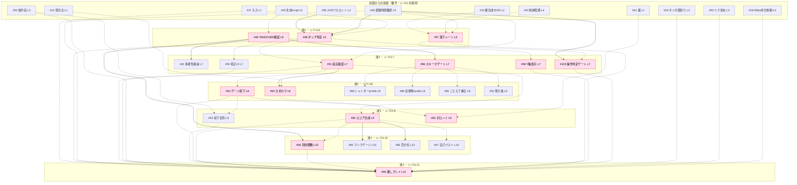

# Issue依存の波層推移図（着手順の正典）

本書は、残りの全Issueの着手順を依存の有向非巡回グラフとして表す。目的は二つ。第一に依存の逆転が起きないこと。第二に最大限の並列化で効率化することである。Issue間の依存と並列可能性は本書を正典とし、`dev-roadmap-gantt.md`（ガント）は時間表として本書に従う。

## 読み方
- 矢印は「前提 → 依存」を表す。矢印は必ず低いレベルから高いレベルへのみ向く（逆転なし）。
- 線種は出典を表す。実線は本文明記（記号B）、破線はデータフロー必須（記号D）である。
- 各ノードの末尾の `L数字` はレベル（最早着手段）である。同じ波の中にも依存が残るため、波は完全並列ではなくレベルの束である。
- 赤い強調は優先度P0である。
- 図をまたぐ前提は、各図の冒頭「前図からの前提」に番号とレベルを保ったまま示す。

## 出典規則（採用理由を先に明記）
本文明記Bだけでは実装上必須の前提（例として、ひまわり #60 は発光点基盤 #10 が無ければ描画できない）が抜け落ち、実装時に依存が逆転する。これを防ぐためデータフローDを併用する。逆に、消費・生成の関係が無いものはエッジにせず、並列性を最大化する。本文に「連携」とだけ書かれた関係（例として描画性能ゲート #97 と実機テスト #85）は、先行完了を要求しない協調と判断し依存にしない。

## レベルとエッジの確定（機械計算）
レベルは手計算でなく、エッジ集合を入力とした最長経路の計算（自分のレベル＝前提レベルの最大＋1、完了済みはレベル0）で機械的に求めた。理由＝手計算では前提の見落としでレベルを誤るためである。完了済み（レベル0）は #1 から #8、#34、#95 である。計算の結果、巡回はなく、全エッジが「前提レベル＜依存レベル」であり、依存の逆転はゼロである。本体ノード 97 個、本体エッジ 163 本。

最長の依存連鎖（律速経路）: #35 → #36 → #38 → #40 → #49 → #48 → #51 → #54 → #55 → #56 → #59 → #63 → #69 → #74 → #71 → #79 → #87。#70 も #74 と同じレベル14で #71 の共前提である。

確定レベル一覧:
- レベル1（波1）: #9 #10 #11 #12 #13 #16 #20 #31 #35 #41 #47 #64 #82 #83 #94
- レベル2（波1）: #14 #15 #21 #22 #23 #29 #36 #37 #43 #61 #76 #93 #105
- レベル3（波2）: #17 #18 #33 #38 #44 #52 #92 #100 #106
- レベル4（波2）: #19 #39 #40 #81 #98 #99
- レベル5（波2）: #45 #49 #97
- レベル6（波3）: #46 #48 #57
- レベル7（波3）: #42 #50 #51 #58 #96 #103
- レベル8（波3）: #54 #60 #88 #89 #90 #91
- レベル9（波4）: #53 #55 #62
- レベル10（波4）: #56 #65 #66 #67
- レベル11（波4）: #59
- レベル12（波5）: #24 #25 #26 #27 #28 #30 #32 #63 #72 #73 #77 #78 #84 #112
- レベル13（波5）: #68 #69 #85 #101
- レベル14（波6）: #70 #74 #102
- レベル15（波6）: #71 #75 #104
- レベル16（波6）: #79 #86
- レベル17（波6）: #80 #87

## 波と図の分割（時間軸で重ねない）
17段のレベルを6つの波にまとめ、波を共有しない3図に分ける（図A＝波1と波2、図B＝波3と波4、図C＝波5と波6）。各図の担当時間帯は重ならない。

| 波 | レベル範囲 | テーマ |
|---|---|---|
| 波1 基盤・素材 | 1から2 | 描画・音楽・文字・和音の土台 |
| 波2 解析・初期演出 | 3から5 | 拍同期演出・文法基盤・ノーツ配置・距離時間翻訳・描画性能ゲート |
| 波3 ゲーム機構 | 6から8 | プロファイル検証・タップ判定・反応強度・ゲージ |
| 波4 スコア・通し統合 | 9から11 | スコア合成・百分位・通しプレイ #59 |
| 波5 派生・ゲート | 12から13 | 文法応用・撮影と書き出し・灯し分布ゲート |
| 波6 成果物・提出 | 14から17 | 結果画面・成果物統合・規約監査・提出 |

---

## 図A: 波1・波2（レベル1から5）

```mermaid
flowchart TD
  classDef crit fill:#fde,stroke:#d33,color:#000;
  classDef ref fill:#eef,stroke:#88a,color:#333;
  subgraph L1["波1 ・ レベル1"]
    n9["#9 平面反射 L1"]:::crit
    n10["#10 発光点 L1"]:::crit
    n11["#11 ブルーム L1"]:::crit
    n12["#12 雨 L1"]
    n13["#13 カメラ軌跡 L1"]:::crit
    n16["#16 拍同期 L1"]:::crit
    n20["#20 SDF文字 L1"]:::crit
    n31["#31 DOM歌詞 L1"]:::crit
    n35["#35 和音パーサ L1"]:::crit
    n41["#41 見せ場 L1"]
    n47["#47 入力 L1"]:::crit
    n64["#64 ミクVRM L1"]:::crit
    n82["#82 クレジット L1"]:::crit
    n83["#83 README L1"]:::crit
    n94["#94 モーション規約保留 L1"]
  end
  subgraph L2["波1 ・ レベル2"]
    n14["#14 3D文字高品質 L2"]
    n15["#15 層合成3D2D L2"]:::crit
    n21["#21 文字分割 L2"]
    n22["#22 シェーダ変形 L2"]
    n23["#23 文法①スマッシュ L2"]:::crit
    n29["#29 粒度切替 L2"]:::crit
    n36["#36 JUST7スロット L2"]:::crit
    n37["#37 NC区間 L2"]
    n43["#43 密度設計 L2"]
    n61["#61 蝶 L2"]:::crit
    n76["#76 揺れ演出 L2"]
    n93["#93 ミクモーション L2"]
    n105["#105 舞台土台 L2"]:::crit
  end
  subgraph L3["波2 ・ レベル3"]
    n17["#17 拍同期FX L3"]
    n18["#18 60fps劣化制御 L3"]:::crit
    n33["#33 タイポ譜割り L3"]:::crit
    n38["#38 オンセット L3"]:::crit
    n44["#44 タップ上限 L3"]
    n52["#52 操作音 L3"]:::crit
    n92["#92 ミク常在 L3"]:::crit
    n100["#100 空間品質ゲート L3"]:::crit
    n106["#106 舞台規約保留 L3"]
  end
  subgraph L4["波2 ・ レベル4"]
    n19["#19 実機性能検証 L4"]
    n39["#39 パターン適用 L4"]
    n40["#40 軌跡配置 L4"]:::crit
    n81["#81 フォントサブセット L4"]
    n98["#98 文字可読ゲート L4"]:::crit
    n99["#99 表示同期ゲート L4"]:::crit
  end
  subgraph L5["波2 ・ レベル5"]
    n45["#45 生成script L5"]:::crit
    n49["#49 距離時間翻訳 L5"]:::crit
    n97["#97 描画性能ゲート L5"]:::crit
  end
  n35 -.-> n36
  n35 -.-> n37
  n36 -.-> n38
  n38 -.-> n39
  n38 -.-> n40
  n13 -.-> n40
  n41 -.-> n43
  n43 -.-> n44
  n40 -.-> n45
  n41 -.-> n45
  n43 -.-> n45
  n44 -.-> n45
  n9 --> n105
  n20 --> n14
  n9 -.-> n15
  n10 -.-> n15
  n11 -.-> n15
  n16 --> n17
  n15 -.-> n17
  n15 -.-> n18
  n18 -.-> n19
  n64 --> n92
  n105 -.-> n92
  n64 --> n93
  n20 -.-> n21
  n20 -.-> n22
  n20 -.-> n23
  n16 -.-> n23
  n20 -.-> n29
  n20 --> n33
  n23 --> n33
  n29 --> n33
  n31 -.-> n33
  n13 -.-> n49
  n40 -.-> n49
  n36 -.-> n52
  n10 -.-> n61
  n16 --> n76
  n33 -.-> n81
  n105 -.-> n106
  n18 --> n97
  n19 --> n97
  n92 -.-> n97
  n33 -.-> n98
  n33 --> n99
  n9 -.-> n100
  n11 -.-> n100
  n105 -.-> n100
```

mermaidソース（図A）

---

## 図B: 波3・波4（レベル6から11）

mermaidソース（図B）

---

## 図C: 波5・波6（レベル12から17）

```mermaid
flowchart TD
  classDef crit fill:#fde,stroke:#d33,color:#000;
  classDef ref fill:#eef,stroke:#88a,color:#333;
  subgraph PREV["前図からの前提（番号・レベルを保持）"]
    r64["#64 ミクVRM L1"]:::ref
    r82["#82 クレジット L1"]:::ref
    r83["#83 README L1"]:::ref
    r23["#23 文法①スマッシュ L2"]:::ref
    r29["#29 粒度切替 L2"]:::ref
    r18["#18 60fps劣化制御 L3"]:::ref
    r100["#100 空間品質ゲート L3"]:::ref
    r19["#19 実機性能検証 L4"]:::ref
    r98["#98 文字可読ゲート L4"]:::ref
    r99["#99 表示同期ゲート L4"]:::ref
    r97["#97 描画性能ゲート L5"]:::ref
    r103["#103 操作判定ゲート L7"]:::ref
    r55["#55 スコア合成 L9"]:::ref
    r62["#62 ボロノイ L9"]:::ref
    r65["#65 ランクゲージ L10"]:::ref
    r66["#66 百分位 L10"]:::ref
    r67["#67 自己ベスト L10"]:::ref
    r59["#59 通しプレイ L11"]:::ref
  end
  subgraph L12["波5 ・ レベル12"]
    n24["#24 文法②字間 L12"]
    n25["#25 文法③回転 L12"]
    n26["#26 文法④縦渦 L12"]
    n27["#27 文法⑤残像 L12"]
    n28["#28 文法⑥減衰 L12"]
    n30["#30 感情声量 L12"]
    n32["#32 文字カメラ L12"]
    n63["#63 灯し立上げ L12"]:::crit
    n72["#72 ウォームアップ L12"]
    n73["#73 タイトル磨き L12"]
    n77["#77 設定画面 L12"]
    n78["#78 SE L12"]
    n84["#84 性能最終 L12"]
    n112["#112 一時停止 L12"]
  end
  subgraph L13["波5 ・ レベル13"]
    n68["#68 撮影カメラ L13"]
    n69["#69 PNG書出 L13"]:::crit
    n85["#85 実機マトリクス L13"]
    n101["#101 灯し分布ゲート L13"]:::crit
  end
  subgraph L14["波6 ・ レベル14"]
    n70["#70 共有 L14"]
    n74["#74 結果画面 L14"]:::crit
    n102["#102 両立ゲート L14"]:::crit
  end
  subgraph L15["波6 ・ レベル15"]
    n71["#71 成果物統合 L15"]:::crit
    n75["#75 遷移アニメ L15"]
    n104["#104 ゲート表確定 L15"]:::crit
  end
  subgraph L16["波6 ・ レベル16"]
    n79["#79 AI監査 L16"]:::crit
    n86["#86 応募準備 L16"]:::crit
  end
  subgraph L17["波6 ・ レベル17"]
    n80["#80 静的規約 L17"]
    n87["#87 提出タグ L17"]:::crit
  end
  r59 --> n24
  r59 --> n25
  r59 --> n26
  r59 --> n27
  r59 --> n28
  r23 -.-> n24
  r23 -.-> n25
  r23 -.-> n26
  r23 -.-> n27
  r23 -.-> n28
  r59 --> n30
  r29 -.-> n30
  r59 --> n32
  r29 -.-> n32
  r64 --> n63
  r62 -.-> n63
  r59 -.-> n63
  n63 -.-> n68
  r55 --> n69
  n63 -.-> n69
  n69 -.-> n70
  n74 --> n71
  r62 -.-> n71
  n63 -.-> n71
  r65 -.-> n71
  r66 -.-> n71
  r67 -.-> n71
  n68 -.-> n71
  n69 -.-> n71
  n70 -.-> n71
  r59 -.-> n72
  r59 -.-> n112
  r59 -.-> n73
  r55 -.-> n74
  r66 -.-> n74
  n69 -.-> n74
  n74 -.-> n75
  r59 -.-> n77
  r59 -.-> n78
  n71 -.-> n79
  n79 -.-> n80
  r18 --> n84
  r59 -.-> n84
  r18 --> n85
  r19 --> n85
  n84 -.-> n85
  n71 -.-> n86
  n71 -.-> n87
  n74 -.-> n87
  n79 -.-> n87
  r82 -.-> n87
  r83 -.-> n87
  n86 -.-> n87
  n104 -.-> n87
  r62 --> n101
  n63 -.-> n101
  r98 --> n102
  r100 --> n102
  n101 --> n102
  r97 -.-> n104
  r98 -.-> n104
  r99 -.-> n104
  r100 -.-> n104
  n101 -.-> n104
  n102 -.-> n104
  r103 -.-> n104
```

mermaidソース（図C）

---

## 検証
- レベルは機械計算で確定し、巡回なし・逆転なし・律速経路を出力で確認した。
- 図A・図B・図Cの本体ノードと本体エッジは、確定したエッジ集合（本体ノード 97 個、本体エッジ 163 本）に一致する。図またぎ前提ノードは本体と二重計上しない。
- 図を更新するときは、本書のmermaidソースを直し、mermaidで再レンダリングして `img/roadmap-graph-a.svg`・`roadmap-graph-b.svg`・`roadmap-graph-c.svg` を再生成する。
